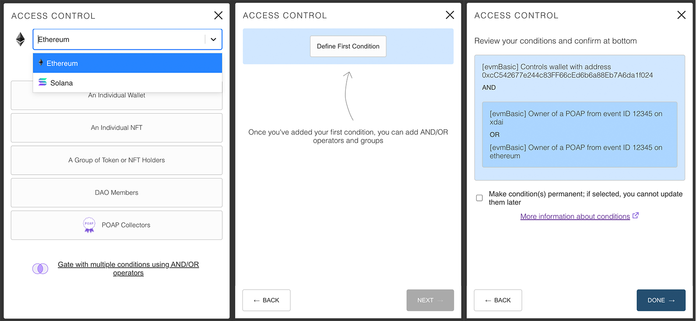
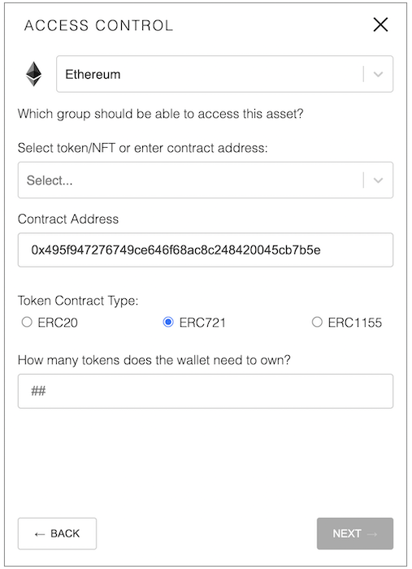

This version of Lit Share Modal is for React

18. [A React 17 version can be found here.](https://www.npmjs.com/package/lit-share-modal-v3-react-17)

[Click here to try out the share modal playground.](https://lit-share-modal-v3-playground.netlify.app/)

[A migration guide on how to upgrade from the v2 share modal to v3 can be found here.](https://lit-services-docs.netlify.app/docs/share-modal/upgradingFromv2)

The Lit Share Modal v3 is a tool for creating access control conditions for securing content with Lit Protocol.
[Click here to visit the Lit Protocol developer docs.](https://developer.litprotocol.com/docs/intro/)

- Secure content based on wallet address, token/NFT holdings, POAP ownership, or DAO membership.
- Create multiple paths for unlocking content by using AND/OR operators.
- Set your most used tokens/NFTs as defaults for quick and easy access.



*Note for NextJS users:* If you are using NextJS, the CSS injection will not work. Set the `injectCSS` prop to false,
and
import the CSS file directly from `node_modules/lit-share-modal/dist/ShareModal.css` in `_app.tsx` or `_app.jsx`.

# Installation

with npm

```
npm install --save lit-share-modal-v3
```

with yarn

```
yarn add lit-share-modal-v3
```

# Usage

with React Hooks

Despite being called a modal, modal functionality is not included in this package in order to give developers maximum
flexibility over implementation.  **Lit Share Modal** can be used in modal form or embedded in a page. An example of
both is provided below.

as a modal

```
import ShareModal from 'lit-share-modal-v3';
import { useState } from 'react';
import './App.css'

const App = () => {
  const [showShareModal, setShowShareModal] = useState(false);

  const onUnifiedAccessControlConditionsSelected = (shareModalOutput) => {
    // do things with share modal output
  }

  return (
    <div className={'App'}>
      <button onClick={() => setShowShareModal(true)}>
        Show Share Modal
      </button>
    
      {showShareModal && (
        <div className={'lit-share-modal'}>
          <ShareModal
            onClose={() => {
              setShowShareModal(false);
            }}
            onUnifiedAccessControlConditionsSelected={onUnifiedAccessControlConditionsSelected}
          />
        </div>
      )}
    </div>

  );
}

export default App;

// CSS in App.css

.lit-share-modal {
  width: 500px;
  height: 700px;
  position: absolute;
  left: 50%;
  top: 50%;
  transform: translate(-50%, -50%);
  border: 1px solid #333;
  border-radius: 0.25em;
}

```

as embedded content

```
import ShareModal from 'lit-share-modal-v3';

const App = () => {
  const onUnifiedAccessControlConditionsSelected = (shareModalOutput) => {
    // do things with share modal output
  }

  return (
    <div className={'App'}>
      <ShareModal isModal={false}  // use isModal to hide or display the close modal icon
                  onUnifiedAccessControlConditionsSelected={onUnifiedAccessControlConditionsSelected} />
    </div>

  );
}

export default App;

```

# Props

## Required

- `onClose` - **only necessary for modal format**. Callback for actions to take on closing the modal
- `onUnifiedAccessControlConditionsSelected` - callback for the share modal output

`onUnifiedAccessControlConditionsSelected` provides an object with the following properties:

- `unifiedAccessControlConditions` - an array of objects and nested arrays reflecting the selected conditions
- `permanent` - a boolean signaling whether conditions will be permanent (true) or editable by the author in the
  future (false)

Documentation on how these properties are used with the `LitJsSdk`, can be found in
the [LitJsSdk docs](https://lit-protocol.github.io/lit-js-sdk/api_docs_html/index.html#litnodeclientsavesigningcondition)

## Optional

### Behavior Props

Behavior props allow high level control of the share modal. e.g. passing `defaultChain={solana}`
and `chainsAllowed={['solana']}` will prevent access to EVM chain conditions and allow only the creation of Solana
conditions.

- `defaultChain` - `ethereum` by default. A string can be passed in any of the chains listed in
  the [**Usable Chains** section](#usableChains).
- `chainsAllowed` - all chains in the **Usable Chains** section below are included by default. An array can be passed in
  with specific values to limit the options. e.g. passing in `['ethereum', 'polygon']` would let users only select
  Ethereum or Polygon.
- `allowChainSelector` - `true` by default. Setting as `false` will prevent users from switching between different chain
  conditions types e.g. switching from Ethereum to Solana.
- `allowMultipleConditions` - `true` by default. Setting to `false` will disable the multiple conditions screen and only
  allow the creation of single control conditions.
- `permanentDefault` - `false` by default. Setting to `true` will check by default the box that makes conditions
  uneditable.
- `isModal` - `true` by default. Setting to `false` will hide the close icon in the header.
- `defaultTokens` - set quick access tokens that appear in the `Select a Token/NFT`
  menu. [More information can be found below in the `defaultTokens` section](#defaultToken)

### Initial State Props

Initial state props control the initial state a user encounters upon mount. Props are evaluates in the same order as
listed below.

- `injectInitialState` - `false` by default.  **Must be set to `true` to use initial state conditions. None of the
  following props (basically anything starts with the word `initial`) will register unless this is set to `true`**
- `initialUnifiedAccessControlConditions` - accepts a `unifiedAccessControlConditions`
  object ([more information here](https://developer.litprotocol.com/docs/AccessControlConditions/unifiedAccessControlConditions))
  . <i>If no other initial state conditions are used, the modal state will default to the editor mode on the multiple
  condition flow.</i>
- `initialFlow` - points to `singleCondition` by default. Accepts a string, either `singleCondition`
  or `multipleConditions`. Initial share modal state will reflect that
  prop.  [More information is available below](#initialState).
- `initialCondition` - accepts a string to set the initial condition. Different chains have different condition options
  available. [More information is available below](#initialState).
- `initialState` - accepts an object with properties included to the desired condition type. [More information regarding
  individual condition fields is available below](#initialState).

### Additional Props

- `darkTheme` - `false` by default. Setting as `true` to enable dark mode.
- `allowDevMode` - `false` by default. Setting to `true` will show logs if there are prop type errors and enable the
  ability to see the raw access control conditions in JSON format.
- `injectCSS` - a boolean that is set to true by default. When this is true, the CSS styles will be injected into
  the `<head>` tag of the page when it loads, so there is no need to import any css. You can set this to `false` if you
  want to use your own CSS. For small changes, it's recommended to use the `cssSubstitution` object instead.
- `cssSubstitution` - empty object by default. Allows pinpoint the customization of different components in the share
  modal. More documentation will be available soon.

## Prop references

### <a id="usableChains"></a>Usable Chains

For use with the `defaultChains` and `chainsAllowed` props. Pass the `value` as a string into the respective props to
set
them. `defaultChain` accepts a string, `chainsAllowed` accepts an array of strings.

**Chain values**

| Chain Name            | Chain Value |
|-----------------------|-------------|
| Ethereum              | ethereum    |
| Polygon               | polygon     |
| Fantom                | fantom      |
| xDai                  | xdai        |
| Binance Smart Chain   | bsc         |
| Arbitrum              | arbitrum    |
| Avalance              | avalanche   |
| Avalanche FUJI Testnet | fuji        |
| Harmony               | harmony     |
| Kovan                 | kovan       |
| Goerli                | goerli      |
| Ropstein              | ropstein    |
| Rinkeby               | Rinkeby     |
| Cronos                | cronos      |
| Optimism              | optimism    |
| Celo                  | celo        |
| Aurora                | aurora      |

**Example of setting `Polygon` as the default chain, and allowing `Polygon`, `Ethereum`, and `xDai` as options**

```
  <ShareModal
    defaultChain={'polygon'} // pass as single string
    chainOptions={['polygon', 'ethereum', 'xdai']} // mix of values listed above passed as an array of strings
    onClose={() => {
      setShowShareModal(false);
    }}
    onUnifiedAccessControlConditionsSelected={onUnifiedAccessControlConditionsSelected}
  />
```

### <a id="defaultToken"></a> `defaultTokens` prop

Defines tokens at the top of the select menu for easy access.  `LitGate` is included by default, but this list can be
customized by passing an array of objects with the following properties:

- `label` - name of token/NFT
- `logo` - url of token/NFT favicon
- `value` - token/NFT address
- `symbol` - token/NFT symbol
- `standard` - token standard (ERC20, ERC721, or ERC1155)

**Example of a single entry quick access array**

```
export const defaultTokens = [
  {
    label: "Lit Genesis Gate",
    logo: "https://litgateway.com/favicon.png",
    value: "0xA3D109E28589D2AbC15991B57Ce5ca461Ad8e026",
    symbol: "LITGATE",
    standard: "ERC721",
  }
];
```

### <a id="initialState"></a> `initialFlow`, `initialCondition`, and `initialState` props

[Click here to see an example](#initialPropsExample)

`initialFlow`, `initialCondition`, and `initialState` are technically independent, but can be used together to finely
tune the initially rendered state.

`initialFlow` - defines whether the modal starts in the single condition or multiple conditions flow. Single condition
is default, but can be set to `multipleCondition` to begin in the multiple condition edit screen.

`initialCondition` - passed as a string which renders the respective individual control condition upon startup. Each
chain can use a different variety of values that reflect the conditions available.

`Ethereum`, and `Gnosis (formerly xDai)`:

| Condition Type                  | Value passed to `initialCondition` prop as string |
|---------------------------------|---------------------------------------------------|
| An Individual Wallet            | wallet                                            |
| An Individual NFT               | nft                                               |
| A Group of Token or NFT Holders | group                                             |
| DAO Members                     | dao                                               |
| POAP Collectors                 | poap                                              |

`Polygon`, `Fantom`, `BSC`, `Arbitrum`, `Avalanche`, `Avalanche FUJI Testnet`, `Harmony`, `Mumbai`, `Kovan`, `Goerli`
, `Ropstein`, `Rinkeby`, `Cronos`, `Optimism`, `Celo`, and `Aurora`:

| Condition Type                  | Value passed to `initialCondition` prop as string |
|---------------------------------|---------------------------------------------------|
| An Individual Wallet            | wallet                                            |
| An Individual NFT               | nft                                               |
| A Group of Token or NFT Holders | group                                             |
| DAO Members                     | dao                                               |

`Solana`

| Condition Type        | Value passed to `initialCondition` prop as string |
|-----------------------|---------------------------------------------------|
| An Individual Wallet  | wallet                                            |
| An Individual NFT     | nft                                               |
| A Metaplex Collection | group                                             |

`initialState` - an object that defines the individual form fields available within a given control condition.
Individual fields are optional, and those that are not included will be rendered empty as normal.

For EVM chains (`Ethereum`, `Gnosis (formerly xDai)`, `Polygon`, `Fantom`, `BSC`, `Arbitrum`, `Avalanche`
, `Avalanche FUJI Testnet`, `Harmony`, `Mumbai`, `Kovan`, `Goerli`
, `Ropstein`, `Rinkeby`, `Cronos`, `Optimism`, `Celo`, and `Aurora`:)

```
An Individual Wallet

intialState = {
  address: // wallet address as string
}
```

```
An Individual NFT

intialState = {
  address: // ERC 721 NFT contract address as string,
  tokenId: // NFT token ID as string
}
```

```
A Group of Token or NFT Holders

intialState = {
  address: // token or NFT address as string,
  amount: // amount to own as string,
  contractType: // contract type, either 'ERC20', 'ERC721', or 'ERC1155',
  erc1155TokenId: // ERC1155 token ID as string.  Only necessary if contract type is `ERC1155`
}
```

```
DAO Members

intialState = {
  address: // DAO address as string,
}
```

```
POAP Collectors

can take either POAP Collection ID or POAP Name, not both.  POAP Name has an additional field 'matchCondition' that can be set to either 'contains' or 'equals'

for POAP Name:
intialState = {
  poapName: // name of POAP as string,
  matchCondition: // condition to measure against.  `contains` for contains value of `poapName`, or `equals` for equals exactly the value of `poapName`.  `contains` by default 
}

for POAP ID:
intialState = {
  poapId: // POAP collection ID as string.  note: individual token ID will not work
}
```

### <a id="initialPropsExample"></a> Initial props example

In this example, the share modal will be set to initially render in the **multiple condition flow** on the **Group Token
or NFT Holders condition** with the **Contract Address** and **Token Contract Type** filled in, but the **Amount** field
blank.

<i>Note: the `amount` field is not included in the `initialState` object and will render like normal</i>

```
<ShareModal 
  injectInitialState={true}
  initialFlow={'multipleConditions'}
  initialCondition={'group}
  initialState={
    address: '0x495f947276749ce646f68ac8c248420045cb7b5e',
    contractType: 'ERC721'
  }
/>
```

Result of initial state upon opening the Share Modal:


### <a id="cssSubstitution"></a> `cssSubstitution` prop

**[More information can be found here](https://lit-services-docs.netlify.app/docs/share-modal/cssSubstitution)**
